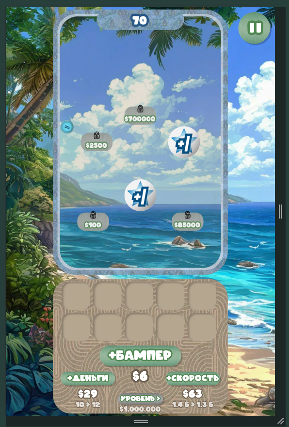
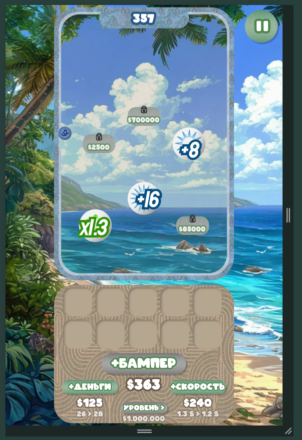

# Демо-игра "Шарики"

Игра делалась летом 2025 года для платформы яндекс игры. 

## Механика
- Idle-игра + Merge. 
- Шарики падают вниз и приносят очки.
- Игрок может покупать "бамперы", от которых шарики будут отскакивать и добавлять или умножать счет. Игрок может соединять одинаковые бамперы, чтобы получить улучшение.

## Технические особенности
- Приятный пляжный дизайн и расслабляющий геймплей
- Node-Based архитектура на PixiJS
- setTimeout и Tween привязанные к requestAnimationFrame
- i18n
- Автоматический ресайзер под вертикальные экраны
- Музыка и звуки
- Физический движок matterJS

## Демо-версия
https://game-preview-85dfd.web.app/

## Скриншоты

